Data Analysis Using Regression and Multilevel/Hierarchical Models
================

<div class="instructions">

Complete all **Exercises**, and submit answers to **Questions** on the
Coursera platform.

</div>

## Grading the professor

Many college courses conclude by giving students the opportunity to
evaluate the course and the instructor anonymously. However, the use of
these student evaluations as an indicator of course quality and teaching
effectiveness is often criticized because these measures may reflect the
influence of non-teaching related characteristics, such as the physical
appearance of the instructor. The article titled, “Beauty in the
classroom: instructors’ pulchritude and putative pedagogical
productivity” \[@Hamermesh2005\] found that instructors who are viewed
to be better looking receive higher instructional ratings.

In this lab we will analyze the data from this study in order to learn
what goes into a positive professor evaluation.

## Getting Started

### Load packages

In this lab we will explore the data using the `dplyr` package and
visualize it using the `ggplot2` package for data visualization. The
data can be found in the companion package for this course, `statsr`.

Let’s load the packages.

``` r
library(statsr)
library(dplyr)
library(ggplot2)
library(report)
library(GGally)
```

This is the first time we’re using the `GGally` package. We will be
using the `ggpairs` function from this package later in the lab.

### The data

The data were gathered from end of semester student evaluations for a
large sample of professors from the University of Texas at Austin. In
addition, six students rated the professors’ physical appearance. (This
is a slightly modified version of the original data set that was
released as part of the replication data for *Data Analysis Using
Regression and Multilevel/Hierarchical Models* \[@Gelman2007\].) The
result is a data frame where each row contains a different course and
columns represent variables about the courses and professors.

Let’s load the data:

``` r
data(evals)
```

| variable        | description                                                                           |
|-----------------|---------------------------------------------------------------------------------------|
| `score`         | average professor evaluation score: (1) very unsatisfactory - (5) excellent.          |
| `rank`          | rank of professor: teaching, tenure track, tenured.                                   |
| `ethnicity`     | ethnicity of professor: not minority, minority.                                       |
| `gender`        | gender of professor: female, male.                                                    |
| `language`      | language of school where professor received education: english or non-english.        |
| `age`           | age of professor.                                                                     |
| `cls_perc_eval` | percent of students in class who completed evaluation.                                |
| `cls_did_eval`  | number of students in class who completed evaluation.                                 |
| `cls_students`  | total number of students in class.                                                    |
| `cls_level`     | class level: lower, upper.                                                            |
| `cls_profs`     | number of professors teaching sections in course in sample: single, multiple.         |
| `cls_credits`   | number of credits of class: one credit (lab, PE, etc.), multi credit.                 |
| `bty_f1lower`   | beauty rating of professor from lower level female: (1) lowest - (10) highest.        |
| `bty_f1upper`   | beauty rating of professor from upper level female: (1) lowest - (10) highest.        |
| `bty_f2upper`   | beauty rating of professor from second upper level female: (1) lowest - (10) highest. |
| `bty_m1lower`   | beauty rating of professor from lower level male: (1) lowest - (10) highest.          |
| `bty_m1upper`   | beauty rating of professor from upper level male: (1) lowest - (10) highest.          |
| `bty_m2upper`   | beauty rating of professor from second upper level male: (1) lowest - (10) highest.   |
| `bty_avg`       | average beauty rating of professor.                                                   |
| `pic_outfit`    | outfit of professor in picture: not formal, formal.                                   |
| `pic_color`     | color of professor’s picture: color, black & white.                                   |

<div class="question">

Is this an observational study or an experiment?

-   Observational study
-   Experiment

Answer = Experiment

</div>

<div class="question">

The original research question posed in the paper is whether beauty
leads directly to the differences in course evaluations. Given the study
design, should the question be rephrased? If so, how?

-   No, the question is worded accurately.
-   Yes, revise wording to “Is there an association between beauty and
    course evaluations?”
-   Yes, revise wording to “Does beauty score increase the professor’s
    course evaluations?”  
-   Yes, revise wording to “Does beauty score decrease the professor’s
    course evaluations?”

Answer = Yes, revise wording to “Is there an association between beauty
and course evaluations?”

</div>

## Exploring the data

<div class="question">

Which of the following statements is **false** about the distribution of
`score`?

-   The median of the distribution is 4.3.
-   25% of the students gave their professors a score of over 4.6.  
-   11 of students gave a professor a score below 3.  
-   The left skewness of the data suggests that the students are less
    likely to rate the professors highly.

The median of the distribution is 4.3.

</div>

``` r
# type your code for Question 3 here, and Knit
summary(evals$score)
```

    ##    Min. 1st Qu.  Median    Mean 3rd Qu.    Max. 
    ##   2.300   3.800   4.300   4.175   4.600   5.000

<div class="exercise">

**Exercise:** Excluding `score`, select two other variables and describe
their relationship using an appropriate visualization (scatterplot,
side-by-side boxplots, or mosaic plot).

</div>

``` r
# type your code for the Exercise here, and Knit
ggplot(evals, aes(age,cls_perc_eval))+geom_point()+
  geom_smooth(method = "lm")
```

    ## `geom_smooth()` using formula 'y ~ x'

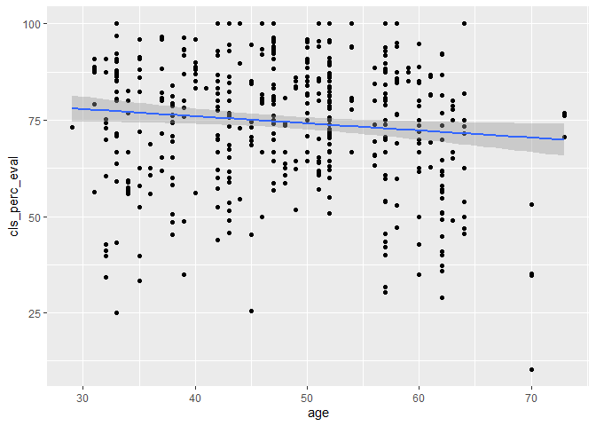<!-- -->

## Simple linear regression

The fundamental phenomenon suggested by the study is that better looking
teachers are evaluated more favorably. Let’s create a scatterplot to see
if this appears to be the case:

``` r
ggplot(data = evals, aes(x = bty_avg, y = score)) +
  geom_point()
```

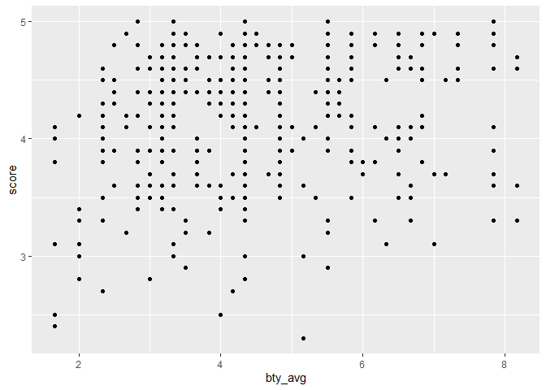<!-- -->

Before we draw conclusions about the trend, compare the number of
observations in the data frame with the approximate number of points on
the scatterplot. Is anything awry?

<div class="exercise">

**Exercise:** Replot the scatterplot, but this time replace the
`geom_point()` layer with a `geom_jitter()` layer. (Use `?geom_jitter`
to learn more.) What was misleading about the initial scatterplot?

</div>

``` r
# type your code for the Exercise here, and Knit
ggplot(data = evals, aes(x = bty_avg, y = score)) +
  geom_point()+geom_jitter()
```

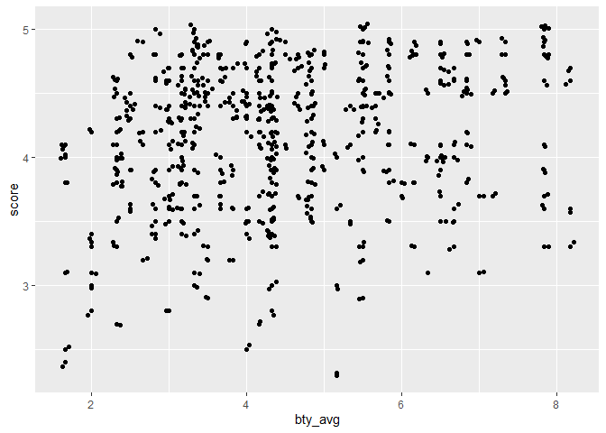<!-- -->

Let’s see if the apparent trend in the plot is something more than
natural variation. Fit a linear model called `m_bty` to predict average
professor score by average beauty rating and add the line to your plot
using the following. If you do not remember how to do this, refer to the
previous lab.

``` r
ggplot(data = evals, aes(x = bty_avg, y = score)) +
  geom_jitter() +
  geom_smooth(method = "lm")
```

    ## `geom_smooth()` using formula 'y ~ x'

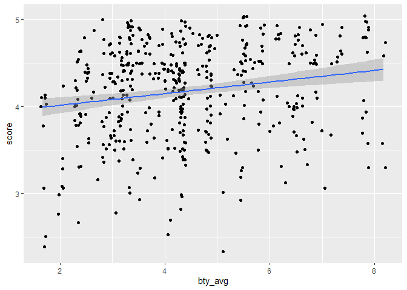<!-- -->

The blue line is the model. The shaded gray area around the line tells
us about the variability we might expect in our predictions. To turn
that off, use `se = FALSE`.

``` r
ggplot(data = evals, aes(x = bty_avg, y = score)) +
  geom_jitter() +
  geom_smooth(method = "lm", se = FALSE)
```

    ## `geom_smooth()` using formula 'y ~ x'

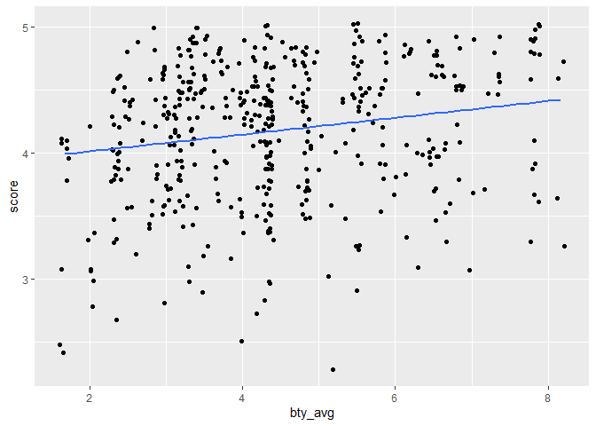<!-- -->

<div class="exercise">

**Exercise:** Print a summary of the linear model, write out the
equation, and interpret the slope.

</div>

``` r
# type your code for the Exercise here, and Knit
m1<- lm(score~bty_avg,data = evals)
 summary(m1)
```

    ## 
    ## Call:
    ## lm(formula = score ~ bty_avg, data = evals)
    ## 
    ## Residuals:
    ##     Min      1Q  Median      3Q     Max 
    ## -1.9246 -0.3690  0.1420  0.3977  0.9309 
    ## 
    ## Coefficients:
    ##             Estimate Std. Error t value Pr(>|t|)    
    ## (Intercept)  3.88034    0.07614   50.96  < 2e-16 ***
    ## bty_avg      0.06664    0.01629    4.09 5.08e-05 ***
    ## ---
    ## Signif. codes:  0 '***' 0.001 '**' 0.01 '*' 0.05 '.' 0.1 ' ' 1
    ## 
    ## Residual standard error: 0.5348 on 461 degrees of freedom
    ## Multiple R-squared:  0.03502,    Adjusted R-squared:  0.03293 
    ## F-statistic: 16.73 on 1 and 461 DF,  p-value: 5.083e-05

answer: yhat = 3.88+0.006\*bty\_avg

<div class="question">

Average beauty score is a statistically significant predictor of
evaluation score.

-   True
-   False

True

</div>

<div class="question">

Use residual plots to evaluate whether the conditions of least squares
regression are reasonable. Which of the following statements is an
incorrect analysis of the residual plots and conditions?

-   Linear association: The residuals plot shows a random scatter.
-   Constant variance of residuals: No fan shape in residuals plot.
-   Nearly normal residuals: Residuals are right skewed, but the sample
    size is large, so this may not be an important violation of
    conditions.
-   Independent observations: Classes sampled randomly, no order effect.

Nearly normal residuals: Residuals are right skewed, but the sample size
is large, so this may not be an important violation of conditions.

</div>

``` r
 #type your code for the Question 5 here, and Knit
ggplot(m1,aes(sample=.resid))+stat_qq()
```

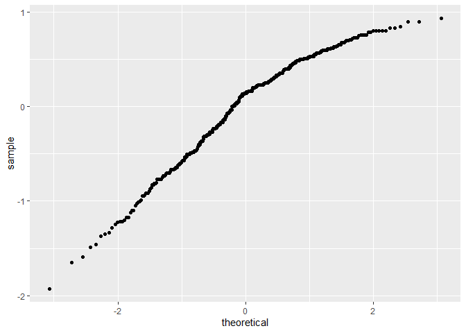<!-- -->

``` r
ggplot(m1,aes(.resid))+geom_histogram()
```

    ## `stat_bin()` using `bins = 30`. Pick better value with `binwidth`.

<!-- -->

## Multiple linear regression

The data set contains several variables on the beauty score of the
professor: individual ratings from each of the six students who were
asked to score the physical appearance of the professors and the average
of these six scores. Let’s take a look at the relationship between one
of these scores and the average beauty score.

``` r
ggplot(data = evals, aes(x = bty_f1lower, y = bty_avg)) +
  geom_jitter()
```

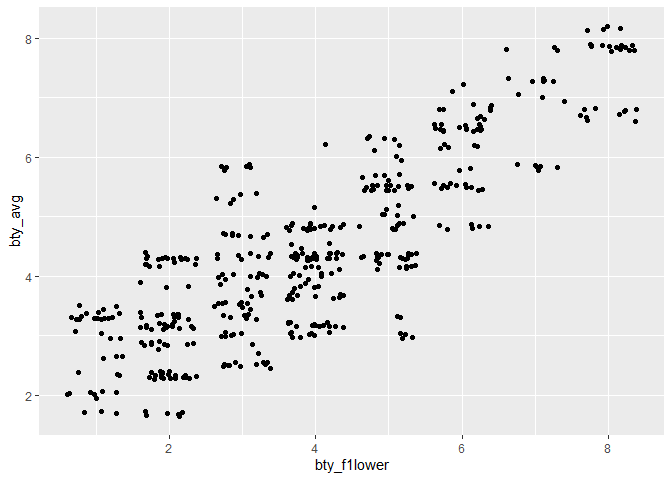<!-- -->

``` r
evals %>% 
  summarise(cor(bty_avg, bty_f1lower))
```

    ## # A tibble: 1 x 1
    ##   `cor(bty_avg, bty_f1lower)`
    ##                         <dbl>
    ## 1                       0.844

As expected the relationship is quite strong - after all, the average
score is calculated using the individual scores. We can actually take a
look at the relationships between all beauty variables (columns 13
through 19) using the following command:

``` r
ggpairs(evals, columns = 13:19)
```

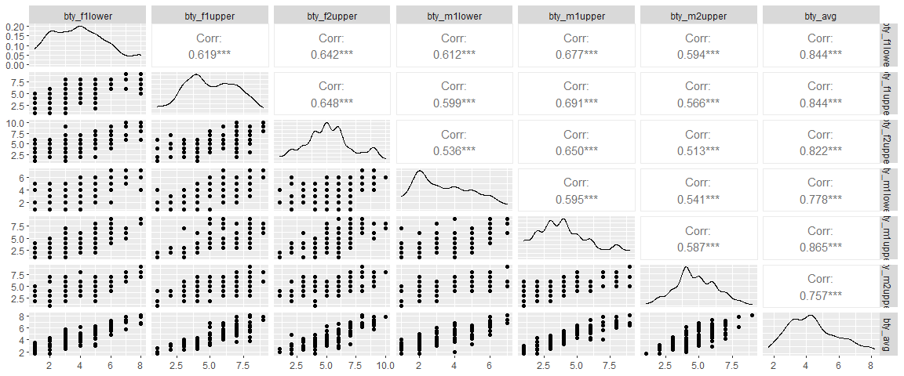<!-- -->

These variables are collinear (correlated), and adding more than one of
these variables to the model would not add much value to the model. In
this application and with these highly-correlated predictors, it is
reasonable to use the average beauty score as the single representative
of these variables.

In order to see if beauty is still a significant predictor of professor
score after we’ve accounted for the gender of the professor, we can add
the gender term into the model.

``` r
m_bty_gen <- lm(score ~ bty_avg + gender, data = evals)
summary(m_bty_gen)
```

    ## 
    ## Call:
    ## lm(formula = score ~ bty_avg + gender, data = evals)
    ## 
    ## Residuals:
    ##     Min      1Q  Median      3Q     Max 
    ## -1.8305 -0.3625  0.1055  0.4213  0.9314 
    ## 
    ## Coefficients:
    ##             Estimate Std. Error t value Pr(>|t|)    
    ## (Intercept)  3.74734    0.08466  44.266  < 2e-16 ***
    ## bty_avg      0.07416    0.01625   4.563 6.48e-06 ***
    ## gendermale   0.17239    0.05022   3.433 0.000652 ***
    ## ---
    ## Signif. codes:  0 '***' 0.001 '**' 0.01 '*' 0.05 '.' 0.1 ' ' 1
    ## 
    ## Residual standard error: 0.5287 on 460 degrees of freedom
    ## Multiple R-squared:  0.05912,    Adjusted R-squared:  0.05503 
    ## F-statistic: 14.45 on 2 and 460 DF,  p-value: 8.177e-07

<div class="question">

P-values and parameter estimates should only be trusted if the
conditions for the regression are reasonable. Using diagnostic plots, we
can conclude that the conditions for this model are reasonable.

-   True
-   False

Answer= True

</div>

</div>

``` r
# type your code for the Exercise here, and Knit

ggplot(m_bty_gen ,aes(.fitted,.resid))+geom_point()+
  geom_smooth(method = "lm")
```

    ## `geom_smooth()` using formula 'y ~ x'

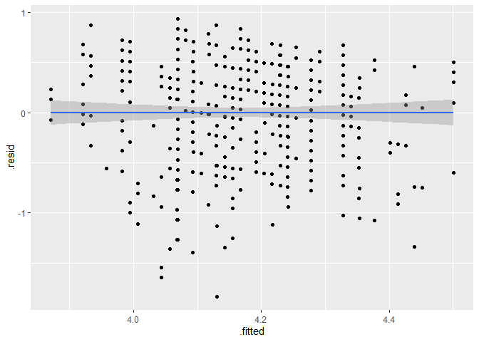<!-- -->

``` r
ggplot(m_bty_gen ,aes(.resid))+geom_histogram()
```

    ## `stat_bin()` using `bins = 30`. Pick better value with `binwidth`.

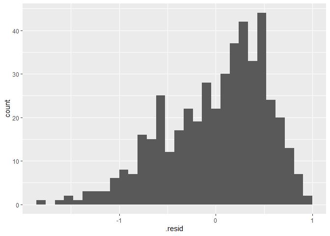<!-- -->

``` r
ggplot(m_bty_gen ,aes(.resid,bty_avg))+geom_point()+
  geom_smooth(method = "lm")
```

    ## `geom_smooth()` using formula 'y ~ x'

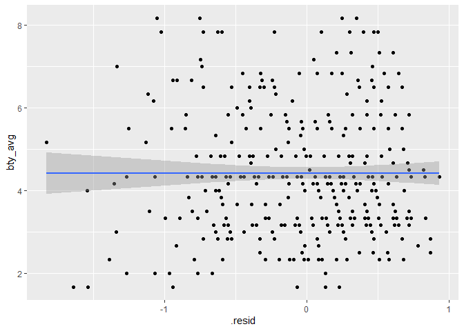<!-- -->

``` r
ggplot(m_bty_gen ,aes(.resid,gender))+geom_point()+coord_flip()+geom_line()
```

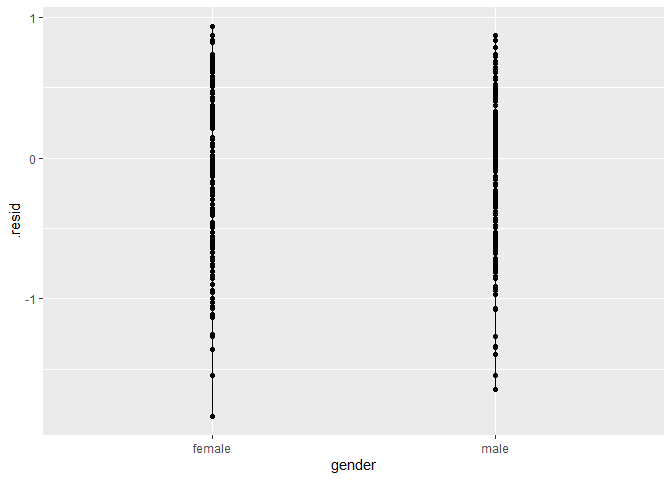<!-- -->

<div class="exercise">

**Exercise:** Print a summary of the multiple linear regression model.
Is `bty_avg` still a significant predictor of `score`? Has the addition
of `gender` to the model changed the parameter estimate for `bty_avg`?

Answer : it is still a predictor and, yes it has changed it.

</div>

``` r
# type your code for the Exercise here, and Knit
summary(m_bty_gen)
```

    ## 
    ## Call:
    ## lm(formula = score ~ bty_avg + gender, data = evals)
    ## 
    ## Residuals:
    ##     Min      1Q  Median      3Q     Max 
    ## -1.8305 -0.3625  0.1055  0.4213  0.9314 
    ## 
    ## Coefficients:
    ##             Estimate Std. Error t value Pr(>|t|)    
    ## (Intercept)  3.74734    0.08466  44.266  < 2e-16 ***
    ## bty_avg      0.07416    0.01625   4.563 6.48e-06 ***
    ## gendermale   0.17239    0.05022   3.433 0.000652 ***
    ## ---
    ## Signif. codes:  0 '***' 0.001 '**' 0.01 '*' 0.05 '.' 0.1 ' ' 1
    ## 
    ## Residual standard error: 0.5287 on 460 degrees of freedom
    ## Multiple R-squared:  0.05912,    Adjusted R-squared:  0.05503 
    ## F-statistic: 14.45 on 2 and 460 DF,  p-value: 8.177e-07

Note that the estimate for `gender` is now called `gendermale`. You’ll
see this name change whenever you introduce a categorical variable. The
reason is that R recodes `gender` from having the values of `female` and
`male` to being an indicator variable called `gendermale` that takes a
value of 0 for females and a value of 1 for males. (Such variables are
often referred to as “dummy” variables.)

As a result, for females, the parameter estimate is multiplied by zero,
leaving the intercept and slope form familiar from simple regression.

$$
\\begin{aligned}
  \\widehat{score} 
    &= \\hat{\\beta}\_0 + \\hat{\\beta}\_1 \\times bty\\\_avg + \\hat{\\beta}\_2 \\times (0) \\\\
    &= \\hat{\\beta}\_0 + \\hat{\\beta}\_1 \\times bty\\\_avg
\\end{aligned}
$$

<div class="question">

For two professors (one male and one female) who received the same
beauty rating, the male professor is predicted to have the higher course
evaluation score than the female.

-   True
-   False

Answer: True

</div>

The decision to call the indicator variable `gendermale` instead
of`genderfemale` has no deeper meaning. R simply codes the category that
comes first alphabetically as a 0. (You can change the reference level
of a categorical variable, which is the level that is coded as a 0,
using the`relevel` function. Use `?relevel` to learn more.)

<div class="exercise">

**Exercise:** Create a new model called `m_bty_rank` with `gender`
removed and `rank` added in. How does R appear to handle categorical
variables that have more than two levels? Note that the rank variable
has three levels: teaching, tenure track, tenured.

</div>

``` r
# type your code for the Exercise here, and Knit
m2<-(lm(score~bty_avg+rank,data = evals))
summary(m2)
```

    ## 
    ## Call:
    ## lm(formula = score ~ bty_avg + rank, data = evals)
    ## 
    ## Residuals:
    ##     Min      1Q  Median      3Q     Max 
    ## -1.8713 -0.3642  0.1489  0.4103  0.9525 
    ## 
    ## Coefficients:
    ##                  Estimate Std. Error t value Pr(>|t|)    
    ## (Intercept)       3.98155    0.09078  43.860  < 2e-16 ***
    ## bty_avg           0.06783    0.01655   4.098 4.92e-05 ***
    ## ranktenure track -0.16070    0.07395  -2.173   0.0303 *  
    ## ranktenured      -0.12623    0.06266  -2.014   0.0445 *  
    ## ---
    ## Signif. codes:  0 '***' 0.001 '**' 0.01 '*' 0.05 '.' 0.1 ' ' 1
    ## 
    ## Residual standard error: 0.5328 on 459 degrees of freedom
    ## Multiple R-squared:  0.04652,    Adjusted R-squared:  0.04029 
    ## F-statistic: 7.465 on 3 and 459 DF,  p-value: 6.88e-05

<div class="question">

Which of the following is the correct order of the three levels of rank
if we were to order them from lowest predicted course evaluation score
to highest predicted course evaluation score?

-   Teaching, Tenure Track, Tenured
-   Tenure track, Tenured
-   Tenure Track, Tenured, Teaching
-   Teaching, Tenured, Tenure Track

Answer = Teaching, Tenure Track, Tenured

</div>

The interpretation of the coefficients in multiple regression is
slightly different from that of simple regression. The estimate for
`bty_avg` reflects how much higher a group of professors is expected to
score if they have a beauty rating that is one point higher *while
holding all other variables constant*. In this case, that translates
into considering only professors of the same rank with `bty_avg` scores
that are one point apart.

## Prediction

Suppose we want to use the model we created earlier, `m_bty_gen` to
predict the evaluation score for a professor, Dr. Hypo Thetical, who is
a male tenure track professor with an average beauty of 3.

If we wanted to do this by hand, we would simply plug in these values
into the linear model.

We can also calculate the predicted value in R.

First, we need to create a new data frame for this professor.

``` r
newprof <- data.frame(gender = "male", bty_avg = 3)
```

Note that I didn’t need to add `rank = "tenure track"` to this data
frame since this variable is not used in our model.

Then, I can do the prediction using the `predict` function:

``` r
predict(m_bty_gen, newprof)
```

    ##        1 
    ## 4.142194

``` r
summary(m_bty_gen)
```

    ## 
    ## Call:
    ## lm(formula = score ~ bty_avg + gender, data = evals)
    ## 
    ## Residuals:
    ##     Min      1Q  Median      3Q     Max 
    ## -1.8305 -0.3625  0.1055  0.4213  0.9314 
    ## 
    ## Coefficients:
    ##             Estimate Std. Error t value Pr(>|t|)    
    ## (Intercept)  3.74734    0.08466  44.266  < 2e-16 ***
    ## bty_avg      0.07416    0.01625   4.563 6.48e-06 ***
    ## gendermale   0.17239    0.05022   3.433 0.000652 ***
    ## ---
    ## Signif. codes:  0 '***' 0.001 '**' 0.01 '*' 0.05 '.' 0.1 ' ' 1
    ## 
    ## Residual standard error: 0.5287 on 460 degrees of freedom
    ## Multiple R-squared:  0.05912,    Adjusted R-squared:  0.05503 
    ## F-statistic: 14.45 on 2 and 460 DF,  p-value: 8.177e-07

We can also construct a prediction interval around this prediction,
which will provide a measure of uncertainty around the prediction.

``` r
predict(m_bty_gen, newprof, interval = "prediction", level = 0.95)
```

    ##        fit      lwr      upr
    ## 1 4.142194 3.100559 5.183829

Hence, the model predicts, with 95% confidence, that a male professor
with an average beauty score of 3 is expected to have an evaluation
score between 3.1 and 5.18.

## The search for the best model

We will start with a full model that predicts professor score based on
rank, ethnicity, gender, language of the university where they got their
degree, age, proportion of students that filled out evaluations, class
size, course level, number of professors, number of credits, average
beauty rating, outfit, and picture color.

<div id="exercise>
Which variable would you expect to have the highest p-value in this model? Why? 
*Hint:* Think about which variable would you expect to not have any association 
with the professor score.
</div>

Let's run the model...


```r
m_full <- lm(score ~ rank + ethnicity + gender + language + age + cls_perc_eval 
             + cls_students + cls_level + cls_profs + cls_credits + bty_avg 
             + pic_outfit + pic_color, data = evals)
summary(m_full)
```

```
## 
## Call:
## lm(formula = score ~ rank + ethnicity + gender + language + age + 
##     cls_perc_eval + cls_students + cls_level + cls_profs + cls_credits + 
##     bty_avg + pic_outfit + pic_color, data = evals)
## 
## Residuals:
##      Min       1Q   Median       3Q      Max 
## -1.77397 -0.32432  0.09067  0.35183  0.95036 
## 
## Coefficients:
##                         Estimate Std. Error t value Pr(>|t|)    
## (Intercept)            4.0952141  0.2905277  14.096  < 2e-16 ***
## ranktenure track      -0.1475932  0.0820671  -1.798  0.07278 .  
## ranktenured           -0.0973378  0.0663296  -1.467  0.14295    
## ethnicitynot minority  0.1234929  0.0786273   1.571  0.11698    
## gendermale             0.2109481  0.0518230   4.071 5.54e-05 ***
## languagenon-english   -0.2298112  0.1113754  -2.063  0.03965 *  
## age                   -0.0090072  0.0031359  -2.872  0.00427 ** 
## cls_perc_eval          0.0053272  0.0015393   3.461  0.00059 ***
## cls_students           0.0004546  0.0003774   1.205  0.22896    
## cls_levelupper         0.0605140  0.0575617   1.051  0.29369    
## cls_profssingle       -0.0146619  0.0519885  -0.282  0.77806    
## cls_creditsone credit  0.5020432  0.1159388   4.330 1.84e-05 ***
## bty_avg                0.0400333  0.0175064   2.287  0.02267 *  
## pic_outfitnot formal  -0.1126817  0.0738800  -1.525  0.12792    
## pic_colorcolor        -0.2172630  0.0715021  -3.039  0.00252 ** 
## ---
## Signif. codes:  0 '***' 0.001 '**' 0.01 '*' 0.05 '.' 0.1 ' ' 1
## 
## Residual standard error: 0.498 on 448 degrees of freedom
## Multiple R-squared:  0.1871, Adjusted R-squared:  0.1617 
## F-statistic: 7.366 on 14 and 448 DF,  p-value: 6.552e-14
```

<div id=" exercise="">

**Exercise:** Check your suspicions from the previous exercise. Include
the model output in your response.

</div>

<div class="question">

Which of the following is the correct intrepetation of the coefficient
associated with the ethnicity variable. <br> Non-minority professors are
expected on average to score …

-   0.12 points lower than minority professors, all else held constant.
-   0.12 points higher than minority professors, all else held
    constant.  
-   0.02 points lower than minority professors, all else held constant.
-   0.02 points higher than minority professors, all else held constant.

\#\#Answer: 0.12 points higher than minority professors, all else held
constant.

</div>

<div class="exercise">

**Exercise:** Drop the variable with the highest p-value and re-fit the
model. Did the coefficients and significance of the other explanatory
variables change? (One of the things that makes multiple regression
interesting is that coefficient estimates depend on the other variables
that are included in the model.) If not, what does this say about
whether or not the dropped variable was collinear with the other
explanatory variables?

</div>

``` r
# type your code for the Exercise here, and Knit
m2 <- lm(score ~ rank + ethnicity + gender + language + age + cls_perc_eval 
             + cls_students + cls_level + cls_credits + bty_avg 
             + pic_outfit + pic_color, data = evals)
summary(m2)
```

    ## 
    ## Call:
    ## lm(formula = score ~ rank + ethnicity + gender + language + age + 
    ##     cls_perc_eval + cls_students + cls_level + cls_credits + 
    ##     bty_avg + pic_outfit + pic_color, data = evals)
    ## 
    ## Residuals:
    ##     Min      1Q  Median      3Q     Max 
    ## -1.7836 -0.3257  0.0859  0.3513  0.9551 
    ## 
    ## Coefficients:
    ##                         Estimate Std. Error t value Pr(>|t|)    
    ## (Intercept)            4.0872523  0.2888562  14.150  < 2e-16 ***
    ## ranktenure track      -0.1476746  0.0819824  -1.801 0.072327 .  
    ## ranktenured           -0.0973829  0.0662614  -1.470 0.142349    
    ## ethnicitynot minority  0.1274458  0.0772887   1.649 0.099856 .  
    ## gendermale             0.2101231  0.0516873   4.065 5.66e-05 ***
    ## languagenon-english   -0.2282894  0.1111305  -2.054 0.040530 *  
    ## age                   -0.0089992  0.0031326  -2.873 0.004262 ** 
    ## cls_perc_eval          0.0052888  0.0015317   3.453 0.000607 ***
    ## cls_students           0.0004687  0.0003737   1.254 0.210384    
    ## cls_levelupper         0.0606374  0.0575010   1.055 0.292200    
    ## cls_creditsone credit  0.5061196  0.1149163   4.404 1.33e-05 ***
    ## bty_avg                0.0398629  0.0174780   2.281 0.023032 *  
    ## pic_outfitnot formal  -0.1083227  0.0721711  -1.501 0.134080    
    ## pic_colorcolor        -0.2190527  0.0711469  -3.079 0.002205 ** 
    ## ---
    ## Signif. codes:  0 '***' 0.001 '**' 0.01 '*' 0.05 '.' 0.1 ' ' 1
    ## 
    ## Residual standard error: 0.4974 on 449 degrees of freedom
    ## Multiple R-squared:  0.187,  Adjusted R-squared:  0.1634 
    ## F-statistic: 7.943 on 13 and 449 DF,  p-value: 2.336e-14

Now we try a different model selection method: adjusted *R*<sup>2</sup>.
Create a new model, `m1`, where you remove `rank` from the list of
explanatory variables. Check out the adjusted *R*<sup>2</sup> of this
new model and compare it to the adjusted *R*<sup>2</sup> of the full
model.

``` r
m1 <- lm(score ~ ethnicity + gender + language + age + cls_perc_eval 
             + cls_students + cls_level + cls_profs + cls_credits + bty_avg, data = evals)
summary(m1)$adj.r.squared
```

Then, try dropping the next variable from the full model (`ethnicity`):

``` r
m2 = lm(score ~ rank + gender + language + age + cls_perc_eval + 
    cls_students + cls_level + cls_profs + cls_credits + bty_avg, data = evals)
summary(m2)$adj.r.squared
```

<div class="exercise">

**Exercise:** Repeat this process until you have tried removing each
variable from the full model at a time, and determine removal of which
variable yields the highest improvement in the adjusted *R*<sup>2</sup>.

</div>

``` r
# type your code for the Exercise here, and Knit
m3 = lm(score ~ rank + gender + language + age + cls_perc_eval + 
    cls_students + cls_level+ cls_credits + bty_avg, data = evals)
summary(m3)$adj.r.squared
```

    ## [1] 0.1332238

<div class="question">

Elimination of which variable from the full model yielded the highest
adjusted R-squared?

-   `bty_avg`
-   `cls_profs`  
-   `cls_students`
-   `rank`

\#\#Answer = `cls_profs`

</div>

To complete the model selection we would continue removing variables one
at a time until removal of another variable did not increase adjusted
*R*<sup>2</sup>.

<div class="exercise">

**Exercise:** The original paper describes how these data were gathered
by taking a sample of professors from the University of Texas at Austin
and including all courses that they have taught. Considering that each
row represents a course, could this new information have an impact on
any of the conditions of linear regression?

</div>

<div class="exercise">

**Exercise:** Based on your final model, describe the characteristics of
a professor and course at University of Texas at Austin that would be
associated with a high evaluation score.

</div>

<div class="exercise">

**Exercise:** Would you be comfortable generalizing your conclusions to
apply to professors generally (at any university)? Why or why not?

</div>

<div id="license">

This is a product of OpenIntro that is released under a [Creative
Commons Attribution-ShareAlike 3.0
Unported](http://creativecommons.org/licenses/by-sa/3.0). This lab was
written by Mine Çetinkaya-Rundel and Andrew Bray.

</div>

## References
